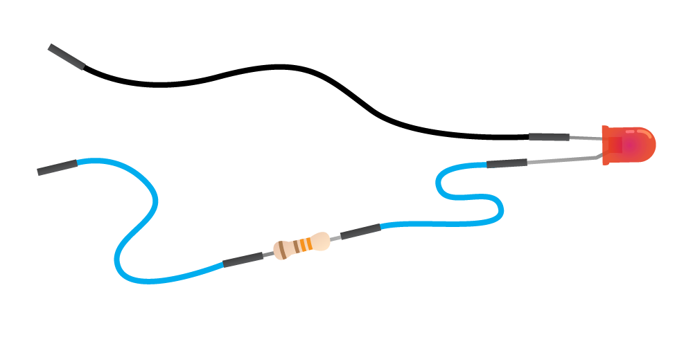
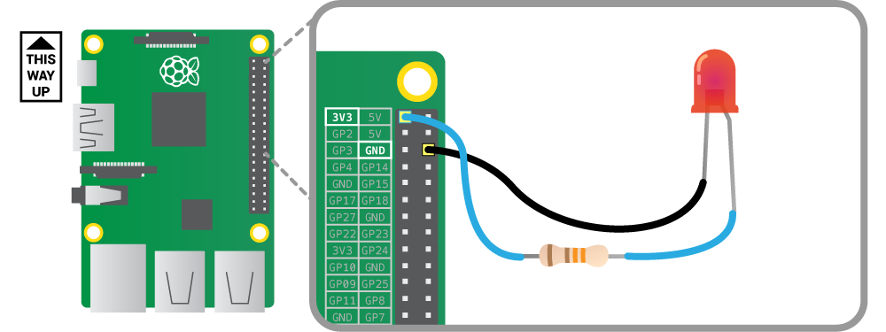

## Set up your LED

--- task ---

+ Slot a jumper wire onto the end of the long leg of your LED

--- /task ---

--- task ---

+ Slot the resistor into the other end of the same jumper wire

--- /task ---

--- task ---

+ Add another jumper wire to the other end of the resistor

--- /task ---

--- task ---

+ Take another jumper wire and slot one end onto the short leg of the LED

***Make sure your Raspberry Pi is switched off for this part.***

Look at the pins that are sticking out of the top right of your Raspberry Pi.

--- /task ---

--- task ---

+ Take the jumper wire that is connected to the resistor and plug it onto the pin lavelled **3V3** on the diagram.

--- /task ---

--- task ---

+ Take the jumper wire that is connected to the short leg of the LED ad plug it into the pin labelled **GND** on the diagram

--- /task ---

## Make your flower

Make your flower out of paper. You can use the guide here for a simple flower. Make two and stack them on top of each other. Be creative with your own designs and colours!

--- task ---

+ Fold your paper in half and in half again (this works best with a square peice of paper)

--- /task ---

--- task ---

+ Fold your paper into a triangle shape

--- /task ---

--- task ---

+ Cut a curve in your triangle

--- /task ---

--- task ---

+ Poke the LED through the middle of your flower

--- /task ---

## Power your flower

Are you ready for some flower power? Create a beautiful bouquet or power your flower by battery and take it with you.

--- task ---

+ Add your flower to other flowers

--- /task ---

--- task ---

+ program the chase effect

CODE HERE

--- /task ---

### Take your flower home

using copper tape and coin battery

simple switch (a petal in between LED leg and battery)

--- save ---
